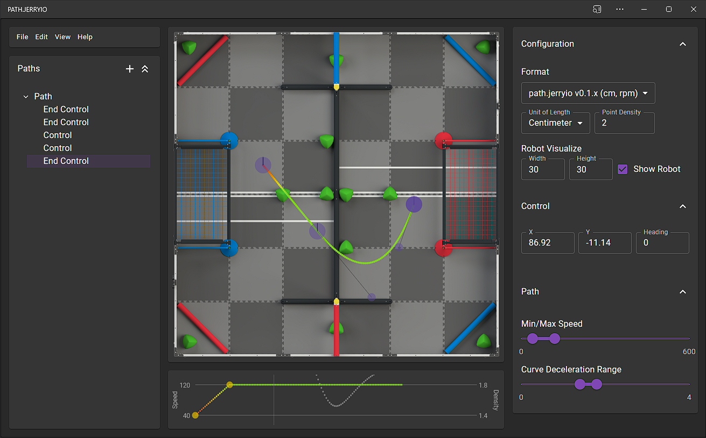

	

<h3 align="center">PATH.JERRYIO</h3>

The best path editor in VRC for designing skills routes and generating path files.

---

## Introduction

Welcome to PATH.JERRYIO!!!

PATH.JERRYIO is created for everyone who takes part in the Vex Robotics Competition:

### For Drivers
This editor can be used to design routes for one-minute driver skill, allowing you to design, preview, and simulate driving routes in a more intuitive way, as well as share driving routes with others more easily.

It is easy to get familiar with PATH.JERRYIO. It shares the same user experience with other graphic design software, like Adobe XD, Sketch, Figma, etc. The hotkeys and mouse gestures are similar and easy to catch up.

All the entities are listed in the path tree panel on the left. You can temporarily hide or lock them from being accidentally moved or adjusted. For drivers, speed control, format settings, and the format of the path file don’t really matter as long as you see the paths in the editor. You can hide the Speed Graph Panel and the Configuration Panel to get a cleaner user interface for you to focus on what you are working on.

### For Programmers Using Vendor Library
If you are using a library with path-following algorithms, and you are looking for a path editor to design the path and generate path files, this is the one you are looking for.

PATH.JERRYIO is designed to be flexible and extensible. It supports multiple interchangeable output formats. Users can choose and change the output format in the editor. That said, even if the library you are using releases a new version with a different path file format in the future, you can still open the old path file in the editor, and upgrade the file format to the new one.

### For Library Developers
PATH.JERRYIO can be used to generate path files for any library as opposed to just one specific library.

PATH.JERRYIO is not just a path file generator for a specific library. It is a path editor that can be used to generate path files for any library. Library developers can create a new format, and submit a pull request to add it to the editor.

Depending on the path following algorithm, what is included in the path file, can be different. For example, a library using pure pursuit may need the coordinate, heading and speed of the path waypoints, while a library using motion profiling may only need the coordinates of the spline control points.

By using PATH.JERRYIO, all they have to do is implement the path file format parser and generator with an easy-to-use API. They can focus on the path file format, path following algorithm, and the code used in the robot, without spending time on the editor and user interface. 

## Main Features

### Functionality
- Real Bézier curves with full control over the shape of each spline
- Add/Delete control points with mouse click
- Split spline or change spline type with mouse click
- Split path into multiple paths (Coming soon)
- Edit the exact coordinate of each control point and end point
- Edit the heading of each end point, support Holonomic drive and Differential drive (See data structure section for more detail)
- Delete multiple control points all at once (Coming soon)
- Undo/Redo support
- Real-time path preview
- Handle multiple paths with custom names at the same time
- Reorder path automatically based on the path name
- Manipulate speed, acceleration, deceleration in detail with speed profile and keyframe
- Set minimum and maximum speed limits, curve deceleration for each path
- Generate evenly-spaced waypoints with customizable point density
- Save/Save as/Download files locally on the computer with ease (meaning that you don’t have to…)
- the format of the path file in the editor are interchangeable 
- Support multiple output format with path editor data included
- Support using any unit of length, even if it differs from the one in the format 
- Support exporting path files with different coordinate systems, unit of length, and more
- Autosave (Coming soon)
- Unsaved change warning
- Robot simulation with customizable robot size (Coming soon)
- Robot pure pursuit simulation (Coming soon)
- Web app without installation
- Auto update
- Offline support

### Editing User Experience
- Hidden shortcut keys and user experience details which can greatly improve your work efficiency
- Zoom in/out with ctrl + mouse wheel while keeping zoom center at the cursor
- Panning support, works outside the canvas
- Interactive control points with mouse drag
- Align to other control points with magnetic effect
- Select/Invert select multiple control points
- Move multiple control points all at once
- Move the end point with or without its handle altogether
- Change end points’ heading with mouse wheel
- Excellent coordinate input support with unit conversion, expression evaluation, arrow key support, and more
- Path tree view with all paths and control points listed
- Lock/Unlock path and control points, to prevent accidental modification
- Hide/Show paths and control points, to allow better view of other paths
- Visualize speed with color
- Customizable editor panel
- Hotkey support
- Drag & Drop to open path file (Coming soon)
- Exclusive editing mode (Coming soon)
- Light and dark theme
- iPad support (Coming soon)

## Usage and Documentation

Please visit our wiki page to understand how to get started with PATH.JERRYIO.

