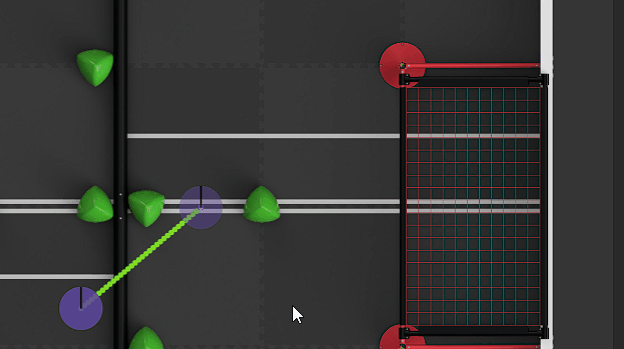

	

<h3 align="center">PATH.JERRYIO</h3>

The best path editor in VRC for designing skills routes and generating path files.

---

## Introduction

PATH.JERRYIO is a Progressive Web Apps (PWA) that is installable and can be used without an internet connection.

It is a powerful and flexible multi-purpose path editor/planner, which allows users to design and edit paths with intuitive click-and-drag interactions. After that, A readable path file can be generated for the robot, it will be used by the robot to travel the designed paths in the autonomous period with path-following algorithms.

## Demonstration

We aim to provide the best environment for path editing and planning within PATH.JERRYIO by focusing on delivering a user experience comparable to industry-grade graphing tools. Here are some examples showing how PATH.JERRYIO can be used:

### Smooth and User-Friendly
The dragging, panning, and area selection interaction continue even when the cursor is outside the canvas. This shows how much effort went into user experience with great attention to detail.

### Intuitive and Straightforward
It is designed to have a similar editing experience to other graphic design software. For example, press shift key to drag multiple controls, hold shift key to enable magnet snapping. The hotkeys, shortcuts and mouse gestures are similar and easy to catch up.

### Professional and Powerful
You'll be amazed at what you can do with PATH.JERRYIO: hide or lock entities, undo/redo any changes you make, manipulate speed for every waypoint. It is the most powerful path editor in VRC.

## It Is for Everyone

PATH.JERRYIO is created for everyone who takes part in the Vex Robotics Competition:

### For Drivers
This editor can be used to design routes for one-minute driver skill, allowing you to design, preview, and simulate driving routes in a more intuitive way, as well as share driving routes with others more easily.

It is easy to get familiar with PATH.JERRYIO. It shares the same editing experience with other graphic design software, like Adobe XD, Sketch, Figma, etc. The hotkeys and mouse gestures are similar and easy to catch up.

All the entities are listed in the Path Panel on the left. You can temporarily hide or lock them from being accidentally moved or adjusted. Since speed control, format settings, and the file format don’t really matter for you, you can hide the Speed Graph Panel and the Configuration Panel to get a cleaner user interface to focus on what you are working on.

### For Programmers Using Vendor Library
If you are using a library with path-following algorithms, and you need a path editor to design the path and generate path files, this is the one you are looking for.

PATH.JERRYIO supports multiple output formats. We are working closely with many library developers to ensure the output files are generated correctly with maximum compatibility. That said, the output files can be opened again in PATH.JERRYIO(also in the future), read by the robot, and can also opened in the library’s path editor too(if there is one)

Select the library you are using in the editor, and you will be able to generate path files with access to all the configuration dedicated to the format you are using.

PATH.JERRYIO is designed to be flexible and extensible. It supports multiple interchangeable output formats. That said, even if the library you are using releases a new version with a different path file format in the future, you can still open the old path file in the editor, and upgrade it to the new one.

### For Library Developers
PATH.JERRYIO can be used to generate path files in any format. It is not just a path file generator for a specific library. Library developers can create a new format, and submit a pull request to add it to the editor.

Depending on the path-following algorithm, what is included in the path file, can be different. For example, a library using pure pursuit may need the coordinate, heading and speed of the path waypoints, while a library using motion profiling may only need the coordinate of the segment control points.

By using PATH.JERRYIO, you only need to implement the path file parser and generator with an easy-to-use API. You can focus on the path file format, path-following algorithm, and the code used in the robot, without spending time on the editor and user interface. 

## Main Features

### Functionality
- Use Bézier curves with full control over the shape of each segment
- Add/Delete control points with mouse click
- Split segment or change segment type with mouse click
- Split path into multiple paths
- Edit the exact coordinate of each control point and end point
- Edit the heading of each end point, support Holonomic drive and Differential drive (See data structure section for more detail)
- Delete multiple control points all at once
- Undo/Redo support
- Cut/Copy/Paste paths and control points
- Reorder paths and control points
- Real-time path preview
- Handle multiple paths with custom names at the same time
- Reorder path automatically based on the path name
- Manipulate speed, acceleration, deceleration in detail with speed profile and keyframe
- Set minimum and maximum speed limits, curve deceleration for each path
- Generate evenly-spaced waypoints with customizable point density
- Save files locally on the computer with ease (Meaning that it is not required to download a new file every time a change is made)
- Interchangeable path file format in the editor
- Support multiple output format with path editor data included
- Support using any unit of length, even if it differs from the one in the format 
- Support exporting path files with different coordinate systems, unit of length, and more
- Unsaved change warning
- Robot simulation with customizable robot size
- Robot pure pursuit simulation (Coming soon)
- Progressive Web Apps use without installation
- Auto update
- Offline support

### Editing Experience
- Hidden shortcut keys and details which can greatly improve your work efficiency
- Zoom in/out with ctrl + mouse wheel while keeping zoom center at the cursor
- Panning support, works outside the canvas
- Interactive control points with mouse drag
- Align to other control points with magnetic effect
- Select/Invert select multiple control points
- Move multiple control points all at once
- Move the end point with or without its handle altogether
- Change end points’ heading with mouse wheel
- Excellent coordinate input support with unit conversion, expression evaluation, arrow key support, and more
- Path tree view with all paths and control points listed
- Lock/Unlock path and control points, to prevent accidental modification
- Hide/Show paths and control points, to allow better view of other paths
- Visualize speed with color
- Customizable editor panels
- Hotkey support
- Drag & Drop to open path file
- Exclusive editing mode (Coming soon)
- Light and dark theme
- iPad support (Coming soon)

## Usage and Documentation

Please visit our [wiki page](https://github.com/Jerrylum/path.jerryio/wiki) to understand how to get started with PATH.JERRYIO.

## Contributing

We welcome contributions from everyone. Before you get started, please see our [contributor's guide](./CONTRIBUTING.md).

## Contributors

We work closely with the community and library developers. We would like to thank the following contributors for their contributions to PATH.JERRYIO: 

